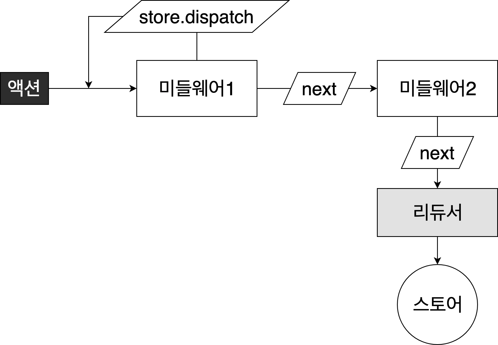
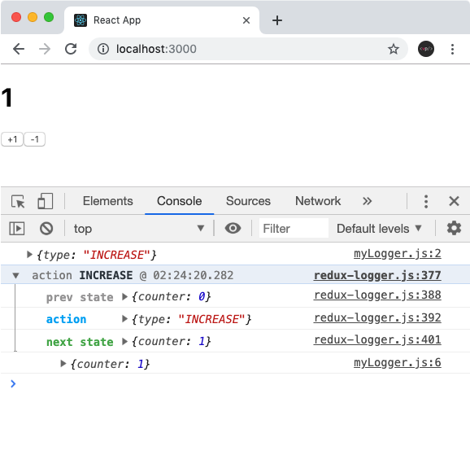
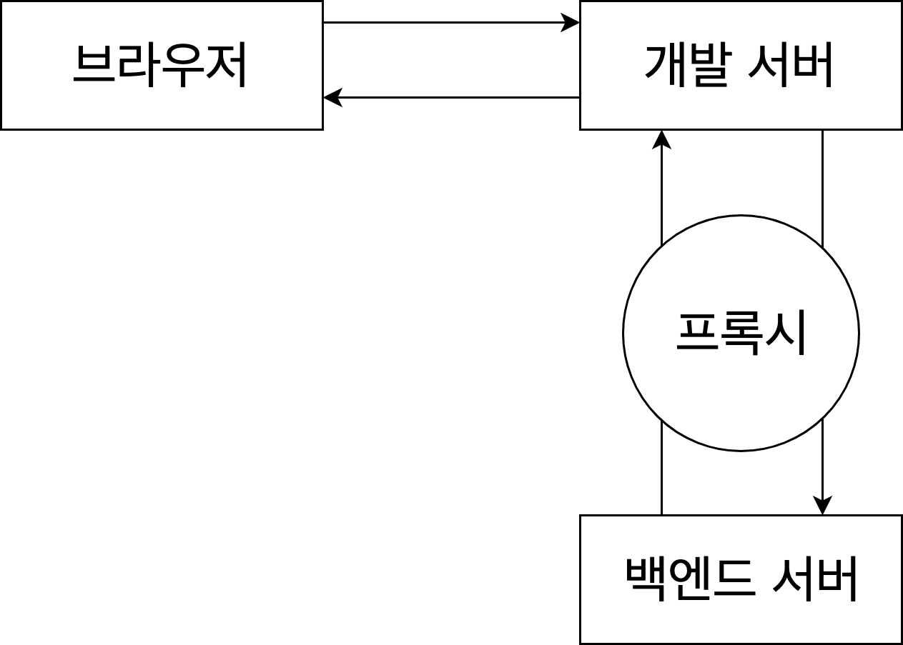
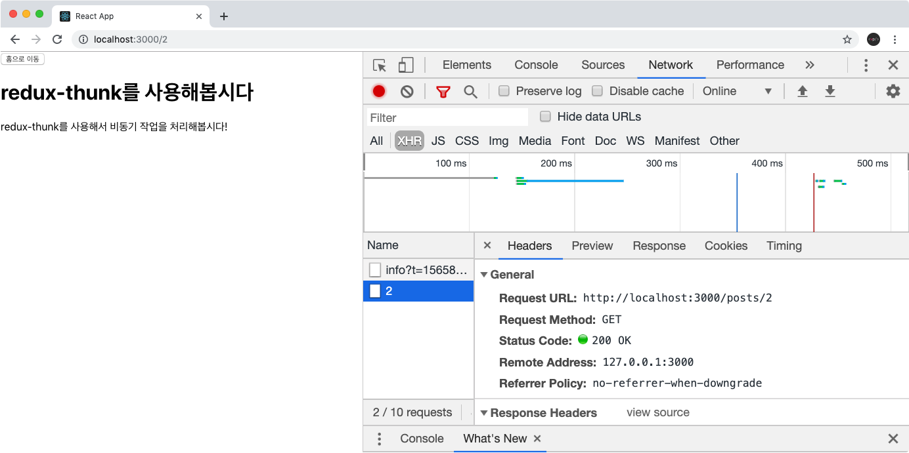

# 리덕스 미들웨어

리덕스 미들웨어는 리덕스가 지니고 있는 핵심 기능(Context API, MobX 차별화)

> 액션 -> 미들웨어 -> 리듀서 -> 스토어

리덕스 미들웨서 사용하면 액션이 디스패치 된 다음, 리듀서에서 해달 액션을 받아 업데이트 하기 전 **추가 작업** 가능

**여기서 언급한 추가 작업이란?**

- 특정 조건에 따라 액션 무시
- 액션을 콘솔에 출력, 서버쪽에 로깅 가능
- 액션 디스패치 시 수정해서 리듀서 전달
- 특정 액션 발생 시 이에 기반하여 다른 액션 발생
- 특정 액션 발생 시 특정 자바스크립트 함수 실행

리덕스에서 미들웨어를 사용하는 주된 이유는 **비동기 작업을 처리**할 때<br>
-> 리액트 앱에서 **백엔드 API 연동**할 경우 리덕스 미들웨어 사용

일반적으로 리덕스 미들웨어는 리덕스 미들웨어 라이브러리 설치하여 사용

**비동기 작업에 관련된 미들웨어 라이브러리**

- redux-thunk
- redux-saga
- redux-observable
- redux-promise-middleware

**redux-saga, redux-observable**</br>
: 특정 액션 모니터링 가능 -> 특정 액션 디스패치 시 원하는 함수 호출, 또는 라우터로 다른 주소 이동 가능</br>
**redux-thunk, redux-saga** : 가장 많이 사용

## 1. 리덕스 프로젝트 준비하기

redux, react-redux 설치

```bash
npm i redux
npm i react-redux
```

### 리덕스 모듈 준비

액션, 액션 생성함수, 리듀서를 한 파일에 작성하는 Ducks패턴 사용

```
modules
    |- index.js // 루트 리듀서
    |- counter.js
```

### 프로젝트에 리덕스 적용

```jsx
/* index.js */
import { createStore } from "redux";
import { Provider } from "react-redux";
import rootReducer from "./modules";

const store = createStore(rootReducer);

ReactDOM.render(
  <Provider store={store}>
    <App />
  </Provider>,
  document.getElementById("root")
);
```

### 프리젠테이셔널 컴포넌트 준비, 컨테이너 만들기

```
components
    |- Counter.jsx // 프레젠테이셔널 컴포넌트 준비
containers
    |- CounterContainer.jsx // 컨테이너 만들기
```

## 2. 미들웨어 만들어보고 이해하기

### 리덕스 미들웨어의 템플릿

리덕스 미들웨어를 만들 때 템플릿을 사용

```jsx
const middleware = (store) => (next) => (action) => {
  // 하고 싶은 작업...
};
```

미들웨어는 결국 하나의 함수이며, 함수를 연달아서 두번 리턴하는 함수</br>
위의 코드를 function 키워드를 사용하여 작성한다면

```jsx
function middleware(store) {
  return function (next) {
    return function (action) {
      // 하고 싶은 작업...
    };
  };
}
```

- **store** : 리덕스 스토어 인스턴스
  - 이안에 dispatch, getState, subscribe 내장함수들이 들어있음
- **next** : 액션을 다음 미들웨어에게 전달하는 함수
  - next(action)이런 형태로 사용
  - 만약 다음 미들웨어가 없다면 리듀서에게 액션을 전다.
  - 만약 next를 호출하지 않게 된다면 액션을 무시되어 리듀서에게 전달되지 않음
- **action** : 현재 처리하고 있는 액션 객체


미들웨어는 위와 같은 구조로 작동</br>
리덕스 스토어에는 여러 개의 미들웨어 등록 가능</br>
-> 새로운 액션이 디스패치 되면 첫 번째로 등록한 미들웨어 호출</br>
-> 만약 미들웨어에서 next(action)을 호출하게 되면 다음 미들웨어로 액션이 넘어감</br>
-> 그리고 만약 미들웨어에서 store.dispatch를 사용하면 다른 액션을 추가적으로 발생시킴

### 미들웨어 직접 작성해보기

```
middlewares
    |- myLogger.js
```

### 미들웨어 적용하기

스토어에 미들웨어를 적용 할 때 applyMiddleware라는 함수를 사용

```jsx
/* index.js */
import { createStore, applyMiddleware } from "redux";
import { Provider } from "react-redux";
import rootReducer from "./modules";
import myLogger from "./middlewares/myLogger";

const store = createStore(rootReducer, applyMiddleware(myLogger));

ReactDOM.render(
  <Provider store={store}>
    <App />
  </Provider>,
  document.getElementById("root")
);
```

### 미들웨어 수정하기

만약 액션이 리듀서까지 전달되고 난 후의 새로운 상태를 확인하고 싶을 경우 아래와 같이 수정

```jsx
/* middlewares/myLogger.js */

const myLogger = (store) => (next) => (action) => {
  console.log(action); // 먼저 액션을 출력합니다.
  const result = next(action); // 다음 미들웨어 (또는 리듀서) 에게 액션을 전달합니다.

  // 업데이트 이후의 상태를 조회합니다.
  console.log("\t", store.getState()); // '\t' 는 탭 문자 입니다.

  return result; // 여기서 반환하는 값은 dispatch(action)의 결과물이 됩니다. 기본: undefined
};

export default myLogger;
```

미들웨어 안에서는 무엇이든지 할 수 있다.</br>
예를 들어 액션 값을 객체가 아닌 함수도 받아오게 만들어서 액션이 함수 타입이면 이를 실행시키게끔 할 수있다.</br>
(이게 추후 배워볼 redux-thunk)

```jsx
const thunk = (store) => (next) => (action) =>
  typeof action === "function"
    ? action(store.dispatch, store.getState)
    : next(action);
```

그러면 나중에 dispatch할 때 다음과 같이 할 수 있다.

```jsx
const myThunk = () => (dispatch, getState) => {
  dispatch({ type: "HELLO" });
  dispatch({ type: "BYE" });
};

dispatch(myThunk());
```

리덕스 관련 값들을 콘솔에 로깅하는건 직접 만드는 것 보단 redux-logger라는 미들웨어를 사용하는게 더욱 좋음

## 3. redux-logger 사용 및 미들웨어와 Dev Tools함께 사용하기

### redux-logger 사용하기

redux-logger 설치

```bash
npm i redux-logger
```

또다시 아래와 같이 설치</br>
redux-devtools-extension이 의존하는 redux 패키지와 프로젝트의 다른 의존성이 충돌하는 상황

```bash
npm install redux-logger --force
```

여러개의 미들웨어 등록 가능

```jsx
/* index.js */
import { createStore, applyMiddleware } from "redux";
import { Provider } from "react-redux";
import rootReducer from "./modules";
import myLogger from "./middlewares/myLogger";
import logger from "redux-logger";

const store = createStore(rootReducer, applyMiddleware(myLogger, logger)); // 여러개의 미들웨어를 적용 할 수 있습니다.

ReactDOM.render(
  <Provider store={store}>
    <App />
  </Provider>,
  document.getElementById("root")
);
```



리덕스 관련 정보들이 콘솔에 출력됨

### Redux DevTools 사용하기

메뉴얼 상의 사용법

```jsx
import { createStore, applyMiddleware } from "redux";
import { composeWithDevTools } from "redux-devtools-extension";

const store = createStore(
  reducer,
  composeWithDevTools(
    applyMiddleware(...middleware)
    // other store enhancers if any
  )
);
```

redux-devtools-extension 설치

```bash
npm i redux-devtools-extension
```

index.js 수정

```jsx
/* index.js 수정 */
import { composeWithDevTools } from "redux-devtools-extension";

const store = createStore(
  rootReducer,
  composeWithDevTools(applyMiddleware(logger))
); // 여러개의 미들웨어를 적용 할 수 있습니다.
```

### 2022년 10월 21일 기준 Redux DevTool는 "이 페키지는 더 이상 사용되지 않습니다."라고 한다.

## 4. redux-thunk

### 소개

redux-thunk는 리덕스에서 비동기 작업을 처리 할 때 가장 많이 사용하는 미들웨어</br>
이 미들웨어를 사용하면 **액션 객체가 아닌 함수를 디스패치 가능**</br>
리덕스 공색 매뉴얼에서도 비동기 작업을 처리하기 위하여 미들웨어 사용하는 예시가 있음

미들웨어를 사용하면 함수를 디스패치 할 수 있는데,</br>
함수를 디스패치 할 때는, 해당 함수에서 dispatch와 getState를 파라미터로 받아주어야 한다.</br>
이 함수를 만들어주는 함수를 thunk라고 부름

thunk의 사용 예시

```js
const getComments = () => (dispatch, getState) => {
  // 이 안에서는 액션을 dispatch 할 수도 있고
  // getState를 사용하여 현재 상태도 조회 할 수 있습니다.
  const id = getState().post.activeId;

  // 요청이 시작했음을 알리는 액션
  dispatch({ type: "GET_COMMENTS" });

  // 댓글을 조회하는 프로미스를 반환하는 getComments 가 있다고 가정해봅시다.
  api
    .getComments(id) // 요청을 하고
    .then((comments) =>
      dispatch({ type: "GET_COMMENTS_SUCCESS", id, comments })
    ) // 성공시
    .catch((e) => dispatch({ type: "GET_COMMENTS_ERROR", error: e })); // 실패시
};
```

tunk 함수에서 async/await를 사용해도 상관없음

```js
const getComments = () => async (dispatch, getState) => {
  const id = getState().post.activeId;
  dispatch({ type: "GET_COMMENTS" }); // 요청을 시작했음을 알리는 액션

  try {
    // 성공
    const comments = await api.getComments(id); // 요청
    dispatch({ type: "GET_COMMENTS_SUCCESS", id, comments });
  } catch (e) {
    // 실패
    dispatch({ type: "GET_COMMENTS_ERROR", error: e });
  }
};
```

### redux-thunk 설치 및 적용하기

```bash
npm i redux-thunk --force
```

redux-thunk를 index.js에 불러와서 applyMiddlewares를 통해 적용

```jsx
// index.js
// 이렇게 설정안하면 오류남

import * as ReduxThunk from "redux-thunk";

const store = createStore(
  rootReducer,
  // logger를 사용하는 경우, logger가 가장 마지막에 와야 된다.
  composeWithDevTools(applyMiddleware(ReduxThunk.thunk, logger))
); // 여러개의 미들웨어 적용 가능
```

### 카운터 딜레이하기

thunk 함수를 만들고, setTimeout를 사용하여 액션이 디스패치되는 것을 1초씩 딜레이시키기

```jsx
// modules/counter.js

// 액션 생성 함수 대용
/* getState를 쓰지 않는다면 굳이 파라미터로 받아올 필요 없다. */
export const increaseAsync = () => (dispatch) => {
  setTimeout(() => dispatch(increase(), 2000));
};
export const decreaseAsync = () => (dispatch) => {
  setTimeout(() => dispatch(decrease(), 2000));
};
```

컨테이너 컴포넌트 수정

```jsx
// containers/CounterContainer.js

const onIncrease = () => {
  dispatch(increaseAsync());
};
const onDecrease = () => {
  dispatch(decreaseAsync());
};
```

버튼들을 클릭하면 액션 디스패치가 딜레이 된다.

## 5. redux-thunk로 프로미스 다루기

### 가짜 API 함수 만들기

Promise를 사용하여 데이터를 반환하는 가짜 API함수 만들어보기

```
api
    |- posts.js
```

### posts 리덕스 모듈 준비

프로미스를 다루는 리덕스 모듈을 다둘 때 **다음과 같은 상황 고려**해야됨

1. 프로미스가 시작, 성공, 실패했을때 따른 액션을 디스패치해야 됨
2. 각 프로미스마다 thunk 함수를 만들어주어야 함.
3. 리듀서에서 액션에 따라 로딩중, 결과, 에러 상태를 변경해주어야 됨

```
modules/posts.js
```

-> 반복되는 코드들이 상당히 많음 => 코드 리팩토링 해야됨

### 리덕스 모듈 리팩토링하기

```
lib
    |- asyncUtils.js // createPromiseThunk, reducerUtils, handleAsyncActions
modules
    |- posts.js // thunk 함수 리팩토링, 리듀서 함수 리팩토링
```

그래도 아직 리듀서쪽에는 여전히 반복되는 코드가 많다. -> 리팩토링 가능

lib/asyncUtils.js

- createPromiseThunk : Promise에 기반한 Thunk를 만들어주는 함수
- reducerUtils : 리듀서에서 사용할 수 있는 여러 유틸 함수들
- handleAsyncActions : 비동기 관련 액션들을 처리하는 리듀서

리팩토링이 끝났으면 이제 이 모듈을 루투 리듀서에 등록

```js
/* modules/index.js */
import { combineReducers } from "redux";
import counter from "./counter";
import posts from "./posts";

const rootReducer = combineReducers({ counter, posts });

export default rootReducer;
```

### 포스트 목록 구현하기

```
components
    |- PostList.jsx // 프리젠테이셔널 컴포넌트, 포스트들 조회하기
containers
    |- PostListContainer.jsx // PostList를 위한 컨테이너 컴포넌트
```

### 리액트 라우터 적용하기

리액트 라우터를 프로젝트에 적용해서 특정 포스트를 읽는 기능 구현

리액트 라우터 설치

```bash
npm i react-router-dom
```

index.js에 설정

```jsx
// 추가된 코드들
import { BrowserRouter } from "react-router-dom";

ReactDOM.render(
  <BrowserRouter>
    <Provider store={store}>
      <App />
    </Provider>
  </BrowserRouter>,
  document.getElementById("root")
);
```

### 포스트 조회하기

포스트를 하나를 조회하는 기능

```
components
    |- Post.jsx // 포스트 조회하기
containers
    |- PostContainer.jsx // postId 값을 props로 받아오고 이값을 라우터의 URL 파라미터로 읽어옴
```

### 라우트 설정하기

```
pages
    |- PostListPage.jsx
    |- PostPage.jsx
```

## 6. API 재로딩 문제 해결하기

사용자에게 나쁜 경험을 제공 할 수 있는 API 재로딩 문제 해결

### 포스트 목록 재로딩 문제 해결하기

포스트 목록이 재로딩 되는 문제 해결 방법

1. 만약 데이터가 이미 존재한다면 요청을 하지 않도록 하는 방법
2. 로딩을 새로하긴 하는데, 로딩중...을 띄우지 않는 것

**만약 데이터가 이미 존재한다면 요청을 하지 않도록 하는 방법**</br>
containers/PostListContainer.jsx 수정

```jsx
// containers/PostListContainer.jsx
useEffect(() => {
  if (data) return; // 수정
  dispatch(getPosts());
}, [data, dispatch]); // 수정
```

-> 포스트 목록이 이미 있는데 재로딩하는 이슈 발생

**로딩을 새로하긴 하는데, 로딩중...을 띄우지 않는 방법**</br>
두번째 방법의 장점 : 사용자에게 좋은 경험을 제공하면서도 뒤로가기를 통해 다시 포스트 목록을 조회 할 때 최신 데이터를 보여줄 수 있음

asyncUtils.js 의 handleAsyncActions 함수 수정

```js
// lib/asyncUtils.js - handleAsyncActions
export const handleAsyncActions = (type, key, keepData = false) => {
  // 수정
  const [SUCCESS, ERROR] = [`${type}_SUCCESS`, `${type}_ERROR`];
  return (state, action) => {
    switch (action.type) {
      case type:
        return {
          ...state,
          [key]: reducerUtils.loading(keepData ? state[key].data : null), // 수정
        };
      case SUCCESS:
        return {
          ...state,
          [key]: reducerUtils.success(action.payload),
        };
      case ERROR:
        return {
          ...state,
          [key]: reducerUtils.error(action.payload),
        };
      default:
        return state;
    }
  };
};
```

keepData라는 파라미터 추가하여 만약 keepData값이 treu로 주어지면 로딩을 할 때에도 데이터를 유지하도록 수정

posts 리덕스 모듈의 리듀서, PostListContainer 수정

```js
// modules/post.js - posts 리듀서
export default function posts(state = initialState, action) {
  switch (action.type) {
    case GET_POSTS:
    case GET_POSTS_SUCCESS:
    case GET_POSTS_ERROR:
      return handleAsyncActions(GET_POSTS, "posts", true)(state, action); // 수정
    case GET_POST:
    case GET_POST_SUCCESS:
    case GET_POST_ERROR:
      return handleAsyncActions(GET_POST, "post")(state, action);
    default:
      return state;
  }
}
```

```jsx
// containers/PostListContainer.jsx
if (loading && !data) return <div>로딩중...</div>; // 수정 : 로딩중이면서, 데이터가 없을 때에만 로딩중... 표시
```

=> 이렇게 구현을 해주고 나면 뒤로가기를 눌렀을 때 새 데이터를 요청하긴 하지만, '로딩중...'이라는 문구를 보여주지 않게 된다.

### 포스트 조회시 재로딩 문제 해결하기

특정 포스트를 조회하는 과정에서 재로딩 문제 해결하려면, 방금 했던 방식으로 처리 할 수 없음</br>
왜냐하면 어떤 파라미터가 주어졌냐에 따라 다른 결과물이 있기 때문

해결방안 두가지

1. 컴포넌트가 언마운트될 때 포스트 내용을 비우도록 하는 것
   - 이 작업을 하려면 posts 리덕스 모듈에 CLEAR_POST라는 액션 준비

```js
// modules/posts.js - 추가된 내용만

// 포스트 비우기
const CLEAR_POST = 'CLEAR_POST';

export const clearPost = () => ({ type: CLEAR_POST });

case CLEAR_POST:
      return {
        ...state,
        post: reducerUtils.initial()
      };
```

PostContainer컴포넌트의 useEffect의 cleanup함수 (useEffect에서 반환하는 함수)에서 해당 액션을 디스패치

```jsx
// containers/PostContainer.jsx
```

이렇게 해주면, 포스트 페이지에서 떠날때마다 포스트를 비우게 되므로,</br>
다른 포스트를 읽을 때 포스트가 보여지는 문제가 해결되버린다. </br>
아쉬운점 : 이미 읽었던 포스트를 불러오려고 할 경우에도 새로 요청을 한다.</br>
-> 이문제를 개션하려면, posts 모듈에서 관리하는 상태의 구조를 바꿔야 한다.</br>

```js
// 기존
{
  posts: {
    data,
    loading,
    error
  },
  post: {
    data,
    loading,
    error,
  }
}

// 변경
{
  posts: {
    data,
    loading,
    error
  },
  post: {
    '1': {
      data,
      loading,
      error
    },
    '2': {
      data,
      loading,
      error
    },
    [id]: {
      data,
      loading,
      error
    }
  }
}
```

asyncUtils.js에 createPromiseThunkById, handleAsyncActionsById 함수 작성

modules/posts.js에서 리덕스 모듈 수정</br>
-> 기존의 CLEAR_POST 액션은 더이상 팔요하지 않으므로 제거

이번에도 포스트 목록 재로딩을 방지하기 위해서 했던 것처럼 아예 요청을 안하는 방법이 있다.</br>

- containers/PostContainer.jsx : 아예 요청을 하지 않는 방식으로 해결
- modules/posts.js - posts : 요청은 하지만 로딩중은 다시 보여주지 않는 방식으로 해결

```jsx
return handleAsyncActionsById(GET_POST, "post", true)(state, action); // 수정
```

**데이터를 제대로 캐싱하고 싶다면 아예 요청을 하지 않는 방식을 택하고,**</br>
**포스트 정보가 바뀔 수 있는 가능성이 있다면 새로 불러오긴 하지만 로딩중은 표시하지 않는 형태로 구현**

## 7. thunk에서 라우터 연동하기 -> 이거한 뒤로 안됨

프로젝트를 개발하다보면, thunk 함수 내에서 라우터를 사용해야 될 때도 있다.</br>
예를 들면, 로그인 요청을 하는데 성공 할 시 / 경로로 이동시키고, 실패 할 시 경로를 유지 하는 형태로 구현

이러한 상황엔 어떻게 구현을 해야되는가?</br>
컨테이너 컴포넌트내에서 단순히 withRouter를 사용해서 props로 history를 가져와서 사용해도 상관없다.</br>
하지만 thunk에서 처리를 하면 코드가 훨씬 깔끔해질 수 있다.

### customHistory 만들어서 적용하기

thunk에서 라우터의 history 객체를 사용하려면, BrowserHistory 인스턴스를 직접 만들어서 적용

- index.js 수정

redux-thunk의 withExtraArgument를 사용하면 thunk함수에서 사전에 정해준 값들을 참조 할 수 있다.

- index.js - 스토어 인스턴스 생성

```js
const store = createStore(
  rootReducer,
  // logger 를 사용하는 경우, logger가 가장 마지막에 와야합니다.
  composeWithDevTools(
    applyMiddleware(
      ReduxThunk.withExtraArgument({ history: customHistory }),
      logger
    )
  )
); // 여러개의 미들웨어를 적용 할 수 있습니다.
```

### 홈 화면으로 가는 thunk 만들기

- modules/posts.js - goToHome
- containers/PostContainer.jsx : thunk를 디스패치하기

## 9. CORS와 Webpack DevServer Proxy

브라우저에서 기본적으로 API를 요청 할 때에는 브라우저의 현재 주소와 API의 주소의 도메인이 일치해야만 데이터를 접근 할 수 있게 되어 있다.
만약 다른 도메인에서 API를 요청해서 사용 할 수 있게 해주려면 CORS설정이 필요</br>

json-server로 만든 서버의 경우 모든 도메인을 허용해주는 CORS규칙이 적용되어 있음</br>
하지만 Open API를 만드는게 아니라면 모든 도메인을 허용하면 안된다.</br>
한다면 특정 도메인만 허용해주어야 됨

실제 서비스를 개발할게 될 때에는 서버의 API를 요청해야 할 때,</br>
기본적으로 localhost:3000에서 들어오는 것을 차단되기 때문에 서버 쪽에 해당 도메인을 허용하도록 구현 해야된다.</br>
백엔드 개발자가 따로 있다면 백엔드 개발자에게 해당 도메인을 허용해달라고 요청 해야겠지만 그럴 필요 없다.</br>
웹팩 개발서버에서 제공하는 Proxy라는 기능이 있기 때문

### Proxy 설정하기



웹팩 개발서버의 프록시를 사용하게 되면, </br>
브라우저 API를 요청 할 때 백엔드 서버에 직접적으로 요청을 하지 않고, 현재 개발서버의 주소로 요청 하게 된다.</br>
그러면 웹팩 개발서버의 proxy 설정은 원래 웹팩 설정을 통해서 적용을 하지만, </br>
CRA를 통해 만든 리액트 프로젝트에서 package.json에서 "proxy"값을 설정하여 쉽게 적용 가능

```json
// package.json
  (...),
  "browserslist": {
    "production": [
      ">0.2%",
      "not dead",
      "not op_mini all"
    ],
    "development": [
      "last 1 chrome version",
      "last 1 firefox version",
      "last 1 safari version"
    ]
  },
  "proxy": "http://localhost:4000" // 추가
}
```

api/posts.js에서 http://localhost:4000/posts 대신에 /posts URL 로 요청 하도록 하면 된다.</br>
이렇게 요청하는 주소의 도메인이 생략된 경우, 현재 페이지의 도메인(지금의 경우 http://localhost:3000)을 가르키게 된다.

```js
// api/posts.js
import axios from "axios";

export const getPosts = async () => {
  const response = await axios.get("/posts");
  return response.data;
};

export const getPostById = async (id) => {
  const response = await axios.get(`/posts/${id}`);
  return response.data;
};
```

Network 탭을 보면 localhost:4000가 아닌 localhost:3000으로 요청 한 것을 볼 수 있다.


나중에 프로젝트를 배포할 경우,</br>
리액트로 만든 서비스와 API가 동일한 도메인에서 제공이되는 경우 이대로 계속 진행을 하면 된다.</br>
하지만, 만약 API의 도메인과 서비스의 도메인이 다르다면 (예: 서비스는 velog.io, API 는 api.velog.io), </br>
axios 의 글로벌 baseURL 을 설정하면 된다.

예를 들어 index.js에서 다음과 같이 작성을 하면 된다.

```js
axios.defaults.baseURL =
  process.env.NODE_ENV === "development" ? "/" : "https://api.velog.io/";
```

- process.env.NODE_ENV는 현재 환경이 프로덕션인지 개발모드인지 볼 수 있는 값

만약 위와 같이 설정 하게 된다면, 개발 환경에선 프록시 서버 쪽으로 요청하고, 프로덕션에선 실제 API서버로 요청을 하게 된다.</br>
이러한 설정은 API 도메인이 실서비스의 도메인과 다를때만 하면 된다.

프로젝트 개발 시 proxy를 사용하는 것은 필수적인건 아니지만, 사용하게 되면 백엔드 쪽에서 불필요한 코드를 아낄 수 있으니</br>
(백엔드에서 개발서버를 위한 CORS 설정을 안해도 되니까) 꽤나 유용한 기능
